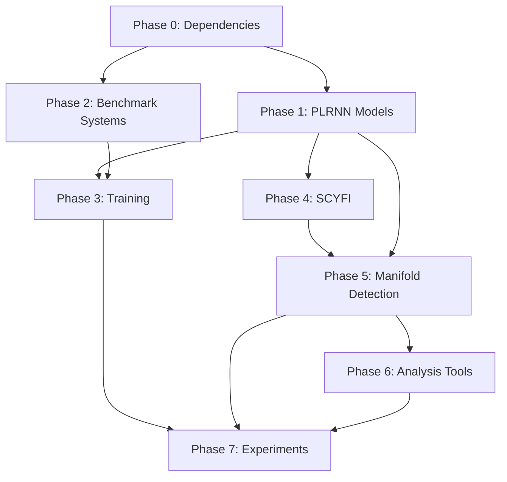

# Master Implementation Plan — Detecting Invariant Manifolds in ReLU-based RNNs

## Overview

Reproduction of *"Detecting Invariant Manifolds in ReLU-based RNNs"* (Eisenmann, Brändle, Monfared & Durstewitz). Implements PLRNN architectures, the SCYFI fixed-point detection algorithm (ported from Julia), the novel manifold detection algorithm (Algorithm 1), and reproduces all simulated experiments from the paper.

**Approach**: Test-Driven Development. Each phase writes failing tests first, then implements until green, then refactors.

**Reference**: [docs/reference/detecting_invariant_manifolds.md](../reference/detecting_invariant_manifolds.md)

## Decisions

| Decision | Choice | Rationale |
|----------|--------|-----------|
| SCYFI implementation | Full port from Julia | Required for all downstream analysis |
| Empirical data (Fig 4D) | Skipped | Cortical neuron data not publicly available |
| ODE integration | `scipy.integrate.solve_ivp` | Standard, well-tested |
| Manifold fitting | `scikit-learn` PCA/kPCA | Established implementations |

## Dependency Graph



**Implementation order**: P0 → P1 → P2 → P3 & P4 (parallel) → P5 → P6 → P7

## Phase Summary

| Phase | Name | Key Deliverable | Needs Research? |
|-------|------|-----------------|-----------------|
| [Phase 0](phase_0.md) | Dependencies & Skeleton | Project structure, all deps installed | No |
| [Phase 1](phase_1.md) | PLRNN Models | PLRNN, shPLRNN, ALRNN modules | No |
| [Phase 2](phase_2.md) | Benchmark Systems | 5 dynamical systems with data generation | No |
| [Phase 3](phase_3.md) | Training Infrastructure | Sparse teacher forcing + regularization | No |
| [Phase 4](phase_4.md) | SCYFI Detection | Fixed point & cycle finder (Julia → Python) | 🔬 Yes |
| [Phase 5](phase_5.md) | Manifold Detection | Algorithm 1, 2, 3 from the paper | 🔬 Yes |
| [Phase 6](phase_6.md) | Analysis Tools | Quality metrics, Lyapunov, homoclinic | No |
| [Phase 7](phase_7.md) | Experiments & Viz | Reproduce Figures 2–5, Table 2 | No |

## Project Layout

```
src/dynamic/
├── models/          # Phase 1
│   ├── plrnn.py
│   ├── shallow_plrnn.py
│   └── alrnn.py
├── systems/         # Phase 2
│   ├── pl_map.py
│   ├── duffing.py
│   ├── lorenz63.py
│   ├── oscillator.py
│   └── decision.py
├── training/        # Phase 3
│   ├── trainer.py
│   ├── losses.py
│   └── configs.py
├── analysis/        # Phase 4–6
│   ├── subregions.py
│   ├── scyfi.py
│   ├── manifolds.py
│   ├── backtracking.py
│   ├── fallback.py
│   ├── homoclinic.py
│   ├── quality.py
│   └── lyapunov.py
└── viz/             # Phase 7
    └── plotting.py

tests/
├── test_models.py
├── test_systems.py
├── test_training.py
├── test_scyfi.py
├── test_subregions.py
├── test_manifolds.py
├── test_backtracking.py
├── test_quality.py
├── test_homoclinic.py
└── test_lyapunov.py

experiments/
├── fig2_invertibility.py
├── fig3_toy_validation.py
├── fig4a_duffing.py
├── fig4b_decision.py
├── fig4c_lorenz.py
└── fig5_chaos.py
```

## Success Criteria

Final verification against Table 2 from the paper:

| Experiment | Expected Δ_σ | Tolerance |
|---|---|---|
| Fig 3A: Toy PL map | 0.98 | ±0.05 |
| Fig 4A: Duffing | 0.97 | ±0.05 |
| Fig 4B: Decision | 0.95 | ±0.10 |
| Fig 4C: Lorenz-63 | 0.78 | ±0.15 |
| Fig 5: Chaos | Homoclinic detected, λ_max > 0 | — |
